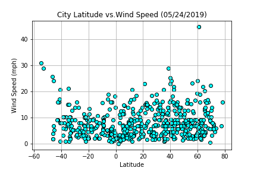

# Global_weather_analysis
Python pragrams for analyzing the golbal weather pattern by pulling data from openweathermap.org. Mainly focusing on the effecs of location latitude on its maximum temperature, cloudness, humidity and wind speed

* Analysis 
500 cities are randomly picked and the current weather data are generatde. We also duplicate the data colllecting from another randomly picked 500 cities on the same day. In the following analysis, two data sets were collected on at around 11 am PDT on 5/24/2019 and one data set was collected at around 11 pm PDT on 5/31/2019.
 * Latitude vs Max temperature
 
  * The locations with high max temperature are located around the equatore (0 degree latitude) with the highest located a little north of the equator (around 10 degree latitude north on 5/31/2019 and around 20 degree latitude noeth on 5/24/2019)
  * The distribution of the max temperature are nearly symmetry around 10 to 20 degree latitude north depends on the observed days. The max temperture become lower for the locations at the higher degree of latitude (both positive (north) and negative (south))

 * Latitude vs Humidity
 
   * No obviour trend are observed in this plot. However, some very dry data are recorded from the location at around 20 degreen latitude at the North hemisphere. 

 * Latitude vs Cloudiness
 
   * No clear trends are shown in this plot.

 * Latitude vs Wind Speed
 
   * The wind speed are not clearly related to the latitude. But we observed some high windspeed data at the locations with higher latitude ( > ~40 degree latitude at both north and south hemispheres).

* Files
  * WeatherPy.ipynb : ipython notebook for analyzing the weather data from openweathermap.org
  * analysis_results : folder for the csv files generated from the ipython notebook, two from 5/24/2019 and one from 5/31/2019
  * Images : png files for latitude vs max temperature, humidity, cloudiness, and wind speed on 5/24/2019 (two files for each) and on 5/31/2019 